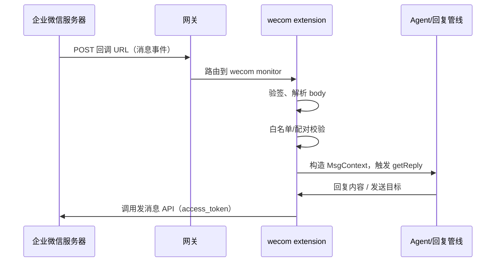
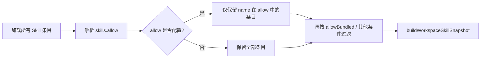
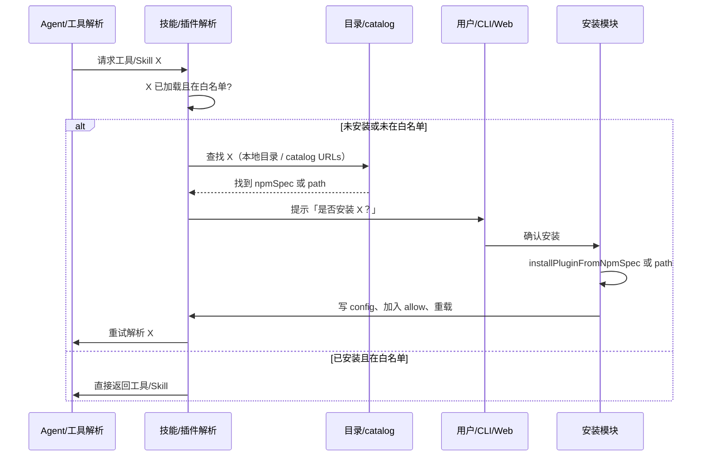
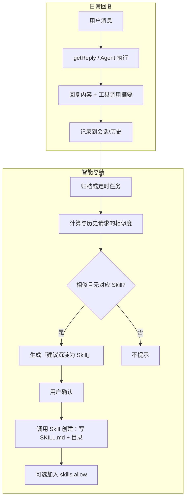
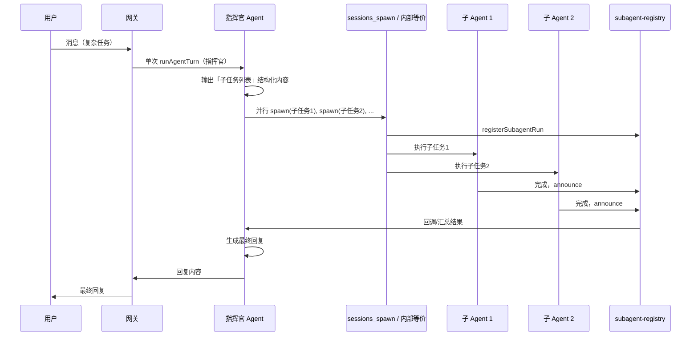
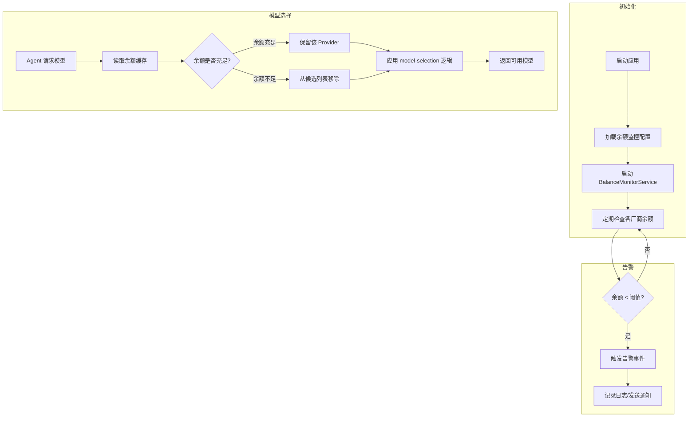

# 国产化开发方案

## 一、企业微信渠道（WeCom / 企微）

### 1.1 功能描述

- **目标**：新增企业微信作为消息渠道，支持单聊、群聊、应用消息与回调。
- **形态**：与 MS Teams 一致，作为**扩展渠道**（extension）实现，不并入 core，便于独立迭代与合规；新项目可从 Panda 复制 `extensions/` 与插件加载机制，在独立目录中新增 `extensions/wecom/`。
- **核心能力**：
  - **收消息**：企业微信应用回调（HTTP POST 到配置的 URL），校验签名、解析 XML/JSON 体，转换为与现有 `MsgContext` 兼容的入站结构。
  - **发消息**：通过企业微信「发送消息到应用」等 API，支持文本、图文、模板卡片等；需 access_token 管理与重试。
  - **配对/白名单**：与现有 pairing/allowlist 一致，支持按 UserID 或部门等做 allowFrom；配对通过后可选发送一条「已通过」类通知。
  - **Probe 与 Onboarding**：probe 检测配置是否有效（如 token 是否可获取）；onboarding 向导引导填写 CorpID、AgentID、Secret、回调 URL 等并写入 config。

### 1.2 业务流程



- **发消息流程**：回复管线或 outbound 调用 `sendMessageWecom(cfg, { to, text, ... })` → 解析 `to`（UserID/ChatID）→ 取 token → 调企业微信 HTTP API → 处理限流/重试。

### 1.3 实现方式

| 项目 | 说明 |
|------|------|
| **参考实现** | Panda 中 `extensions/msteams`：`channel.ts` 暴露 `ChannelPlugin`，实现 `config`、`pairing`、`outbound`、`gateway`、`onboarding`、`status` 等；`monitor.ts` 挂到网关路由；`token.ts` 做凭证解析；`send.ts` 封装发消息 API。 |
| **新项目目录** | 在新仓库中建立 `extensions/wecom/`，包含：`package.json`、`pandabot.plugin.json`、`index.ts`（register channel）、`src/channel.ts`、`src/token.ts`、`src/send.ts`、`src/monitor.ts`、`src/inbound.ts`（解析回调 body）、`src/outbound.ts`、`src/onboarding.ts`、`src/probe.ts`、`src/resolve-allowlist.ts` 等。 |
| **配置** | 如 `channels.wecom.enabled`、`channels.wecom.corpId`、`channels.wecom.agentId`、`channels.wecom.secret`、`channels.wecom.token`（回调校验）、`channels.wecom.encodingAesKey`、`channels.wecom.allowFrom`、`channels.wecom.groupPolicy` / `groupAllowFrom`。 |
| **网关对接** | 扩展通过 `api.registerChannel({ plugin })` 注册；网关在加载插件后为 wecom 注册 HTTP 路由（如 `POST /wecom/callback`），由 monitor 处理请求并转交 reply 管线。 |
| **依赖** | 企业微信开放平台自建应用：CorpID、AgentID、Secret、回调 URL（需公网可访问）、Token 与 EncodingAESKey（回调加解密）。 |

---

## 二、Skills / MCP 白名单 + 找不到时自动查找并确认安装

### 2.1 功能描述

- **白名单**：
  - **Skills**：配置「仅允许加载的 Skill 名称列表」；未在白名单内的 skill 不参与 `buildWorkspaceSkillSnapshot` 的最终候选，Agent 不可见、不可调用。
  - **Plugins/MCP**：沿用 Panda 已有 `plugins.allow`（仅允许的插件 ID 加载）；新项目保持该语义，可选在文档中明确为「MCP/扩展白名单」。
- **自动查找与确认安装**：当 Agent 或用户请求的 Skill/MCP 未安装或未在白名单时，从预设目录或远程 catalog 查找 → 提示用户确认 → 安装并写入 config（并可选加入白名单）。

### 2.2 业务流程

**白名单过滤流程：**



- **实现要点**：在 `loadSkillEntries` 之后、`filterSkillEntries` 时，若 `config.skills.allow` 存在且非空，则只保留 `entry.skill.name` 或 `resolveSkillKey(entry.skill, entry)` 在该数组中的条目；然后再做 `shouldIncludeSkill`（allowBundled、requires 等）。

**自动查找与安装流程：**



### 2.3 实现方式

| 项目 | 说明 |
|------|------|
| **Skills 白名单** | 在 Panda 中：`src/config/types.skills.ts` 的 `SkillsConfig` 增加 `allow?: string[]`；`src/config/zod-schema.ts` 中 `skills` 下增加 `allow: z.array(z.string()).optional()`；`src/agents/skills/config.ts` 中新增 `resolveSkillsAllowlist(config)`，在 `shouldIncludeSkill` 中若 `allow` 存在且非空，则仅当 `skillKey`/`name` 在 allow 中时返回 true；`buildWorkspaceSkillSnapshot` 使用的 `filterSkillEntries` 依赖 `shouldIncludeSkill`，故会自然生效。新项目复制/移植上述逻辑即可。 |
| **Plugins 白名单** | 已有 `plugins.allow`（schema 见 `src/config/schema.ts`）；加载逻辑在 `src/plugins/loader.ts` / `manifest-registry.ts` 中，仅加载 allow 列表中的插件（若配置了 allow）。新项目保持该行为即可。 |
| **自动查找** | 「查找」数据源：本地 `plugins` catalog 文件（如 `~/.pandabot/mpm/plugins.json`）、或配置项 `skills.catalogUrls` / `plugins.catalogUrls` 指向的 JSON；根据「工具名」或「Skill 名」匹配 catalog 中的 npmSpec 或 path。 |
| **确认安装** | 复用 Panda：`src/commands/onboarding/plugin-install.ts` 的 `ensureOnboardingPluginInstalled`（选择 npm/local/skip、调用 `installPluginFromNpmSpec`、`recordPluginInstall`、`enablePluginInConfig`）。新项目在「工具解析失败」或「Skill 未找到」的代码路径中，调用类似逻辑：先查 catalog → 若找到则调一次「确认安装」流程（CLI 用 prompter，Web 用 Gateway 暴露的「请求安装并确认」API），安装完成后写 config、可选追加到 `skills.allow` / `plugins.allow`，然后重载或重试。 |
| **配置** | `skills.allow`（可选 string[]）、`skills.allowBundled`（已有）、`skills.catalogUrls`（可选，用于查找）、`plugins.allow`（已有）、`plugins.catalogUrls`（可选）。 |

---

## 三、Skills 智能总结（重复请求沉淀为 Skill）

### 3.1 功能描述

- **目标**：识别「重复或相似的用户请求」，经用户确认后沉淀为可复用的 Skill（写入 managed skills 或 workspace skills），便于后续直接匹配调用。
- **能力**：
  - **记录**：在会话或全局存储「用户请求文本 + 最终采纳的回复/工具调用摘要」。
  - **相似度**：对历史请求做简单嵌入+相似度或关键词聚类，识别重复模式。
  - **建议**：当检测到「与历史某类请求相似」且「尚未绑定 Skill」时，提示「是否保存为 Skill」；用户确认后，调用「创建 Skill」能力写入 `~/.pandabot/skills` 或 workspace skills。

### 3.2 业务流程



- **记录内容**：至少包含「请求文本」「回复摘要或工具调用序列」；可选「sessionKey」「时间戳」；存储位置可为会话 transcript 目录或单独 DB/文件。
- **相似度**：首版可用「关键词/短语匹配 + 简单向量相似度」（如小型嵌入模型或现有 embedding API）做粗筛；阈值可配置（如 `skills.autoSummarize.similarityThreshold`）。
- **Skill 创建**：参考 Panda 的 `skills/skill-creator/SKILL.md` 与既有「创建 SKILL.md」脚本/工具：根据「请求 + 回复摘要」生成 `name`、`description` 和 body，写入 `managedSkillsDir` 或 workspace 下 `skills/<name>/SKILL.md`。

### 3.3 实现方式

| 项目 | 说明 |
|------|------|
| **记录** | 在回复管线末端或会话持久化处（如写入 transcript 或专门 store）增加钩子：将「当前请求 + 最终回复摘要/工具调用列表」写入存储。新项目可新增 `src/agents/skills/request-log.ts` 或类似，提供 `appendRequestLog(sessionKey, request, summary)`。 |
| **相似度与建议** | 新模块如 `src/agents/skills/summarize.ts`：定期或按条读取历史记录，计算与当前请求的相似度；若超过阈值且无对应 Skill，则生成建议 payload（建议的 skill 名、描述、来源请求）。可配置：`skills.autoSummarize.enabled`、`skills.autoSummarize.similarityThreshold`、`skills.autoSummarize.minOccurrences`（至少出现 N 次再建议）。 |
| **建议展示与确认** | CLI：在会话结束或定时任务后输出「检测到可沉淀请求，是否保存为 Skill？」；Web：通过 Gateway 推送或状态接口展示建议，用户点击确认后调用「创建 Skill」接口。 |
| **创建 Skill** | 封装「根据名称、描述、body 写 SKILL.md」：可调用现有 skill-creator 的指导逻辑生成内容，然后 `fs.writeFile` 到 `managedSkillsDir/<name>/SKILL.md` 或 workspace `skills/<name>/SKILL.md`；可选把 `name` 加入 `skills.allow` 并触发重载。 |
| **配置** | `skills.autoSummarize.enabled`、`skills.autoSummarize.similarityThreshold`、`skills.autoSummarize.minOccurrences`、`skills.autoSummarize.storagePath`（可选）。 |

---

## 四、多智能体集群（指挥官式并行调度）

### 4.1 功能描述

- **目标**：一个「指挥官」Agent 接收复杂任务，拆分为多个子任务，并行调度多个子 Agent 执行，再汇总结果返回。
- **与现有能力关系**：
  - Panda 已有 `broadcast`：同一消息可并行/串行发给多个 Agent（`broadcast.<peerId> = [agentIds]`，`broadcast.strategy = parallel|sequential`）。
  - 已有 `sessions_spawn` 工具：主 Agent 可 spawn 子 Agent 会话执行子任务，结果通过 subagent announce 回传。
  - 本功能是在「单次用户请求」下，由**一个**指挥官 Agent 先做任务分解，再**并行** spawn 多个子任务，最后汇总为一条回复。

### 4.2 业务流程



- **指挥官输出格式**：可在 system prompt 中约定「输出 JSON 或结构化文本」，包含子任务数组（每项：task、label、可选 agentId/model）；运行时解析后调用 `sessions_spawn` 或内部等价 API 并行执行。
- **结果汇总**：子任务结果经现有 `runSubagentAnnounceFlow` 等回到主会话；指挥官在下一轮或同轮「汇总」消息中生成最终答案。

### 4.3 实现方式

| 项目 | 说明 |
|------|------|
| **配置** | 新配置如 `agents.coordinator.enabled`，或复用/扩展 `broadcast.strategy` 为 `coordinator`；指定「指挥官」使用的 agentId/model（可与默认 agent 相同）。 |
| **入口** | 在 `getReplyFromConfig` 或 agent 入口处：若启用 coordinator，则本次请求走「指挥官模式」：先跑一轮指挥官 Agent（带固定 system 片段：要求输出子任务列表），解析输出后调用 spawn 逻辑，等待所有子任务结束，再把结果注入指挥官上下文并再跑一轮生成最终回复。 |
| **spawn 与注册** | 直接复用 `src/agents/tools/sessions-spawn-tool.ts` 的 `createSessionsSpawnTool` 与 `src/agents/subagent-registry.ts` 的 `registerSubagentRun`、`waitForSubagentCompletion`；或在新模块 `src/agents/coordinator.ts`（或 `src/auto-reply/reply/coordinator.ts`）中封装「解析指挥官输出 → 批量 spawn → Promise.all 等待 → 汇总」的流程，不重复造轮子。 |
| **指挥官 Prompt** | 在 `buildAgentSystemPrompt` 或 channel 的 `agentPrompt` 中，当为 coordinator 模式时注入一段说明：要求输出指定格式的子任务列表（如 JSON array），并说明结果将自动汇总。 |
| **并行度与超时** | 子任务数量、并行度、单任务超时需可配置（如 `agents.coordinator.maxConcurrent`、`agents.coordinator.taskTimeoutSeconds`），避免资源打满。 |

---

## 五、国产 LLM 集成分析与适配方案

### 5.1 现有国产 LLM 集成情况

项目已集成以下国产 LLM 厂商：

| 厂商 | Provider ID | 状态 | 基础 URL | 默认模型 |
|------|------------|------|----------|---------|
| **MiniMax** | `minimax` | ✅ 已集成 | `https://api.minimaxi.com/v1` | MiniMax-M2.1, MiniMax-VL-01 |
| **Moonshot (Kimi)** | `moonshot` | ✅ 已集成 | `https://api.moonshot.ai/v1` | kimi-k2.5 |
| **Kimi For Coding** | `kimi-code` | ✅ 已集成 | `https://api.kimi.com/coding/v1` | kimi-for-coding |
| **通义千问门户** | `qwen-portal` | ✅ 已集成(OAuth) | `https://portal.qwen.ai/v1` | coder-model, vision-model |
| **Venice** | `venice` | ✅ 已集成 | - | 动态发现 |
| **Ollama** | `ollama` | ✅ 已集成 | `http://127.0.0.1:11434/v1` | 本地模型动态发现 |

**待补充的主流国产厂商：**
- **DeepSeek** (API 兼容 OpenAI)
- **通义千问开放平台** (DashScope API)
- **智谱 AI (GLM)** (API 兼容 OpenAI)
- **百度文心一言** (Wenxin API)
- **腾讯混元** (Hunyuan API)
- **百川智能** (Baichuan API)
- **讯飞星火** (Spark API)

### 5.2 余额监控系统现状

项目已有完整的余额监控类型定义(`src/agents/balance/types.ts`)，包括：
- ✅ `BalanceInfo` 接口（余额、用量、状态）
- ✅ `BalanceChecker` 接口（余额检查器）
- ✅ `BalanceCache` 接口（余额缓存）
- ✅ `BalanceMonitorService` 接口（监控服务）
- ✅ `BalanceMonitorConfig` 配置定义

**需要实现的模块：**
1. 余额检查器实现（各厂商）
2. 余额缓存实现
3. 余额监控服务实现
4. 与 model-selection 的集成

### 5.3 国产 LLM 集成开发方案

#### 5.3.1 新增厂商配置 (`src/agents/models-config.providers.ts`)

参照现有 MiniMax/Moonshot 实现模式，为每个新厂商添加：

```typescript
// DeepSeek 示例
const DEEPSEEK_BASE_URL = "https://api.deepseek.com/v1";
const DEEPSEEK_DEFAULT_MODEL_ID = "deepseek-v3";
const DEEPSEEK_DEFAULT_CONTEXT_WINDOW = 128000;
const DEEPSEEK_DEFAULT_MAX_TOKENS = 8192;

function buildDeepSeekProvider(): ProviderConfig {
  return {
    baseUrl: DEEPSEEK_BASE_URL,
    api: "openai-completions",
    models: [
      {
        id: DEEPSEEK_DEFAULT_MODEL_ID,
        name: "DeepSeek V3",
        reasoning: true,
        input: ["text"],
        cost: { input: 0.14, output: 0.28, cacheRead: 0.014, cacheWrite: 0.07 },
        contextWindow: DEEPSEEK_DEFAULT_CONTEXT_WINDOW,
        maxTokens: DEEPSEEK_DEFAULT_MAX_TOKENS,
      },
    ],
  };
}
```

#### 5.3.2 余额监控实现路径

**文件结构：**
```
src/agents/balance/
  ├── types.ts                    # ✅ 已有
  ├── cache.ts                    # 🆕 实现 BalanceCache
  ├── service.ts                  # 🆕 实现 BalanceMonitorService
  ├── checkers/
  │   ├── minimax.ts              # 🆕 MiniMax 余额检查器
  │   ├── deepseek.ts             # 🆕 DeepSeek 余额检查器
  │   ├── qwen.ts                 # 🆕 通义千问余额检查器
  │   ├── zhipu.ts                # 🆕 智谱 AI 余额检查器
  │   └── index.ts                # 🆕 统一导出
  └── integration.ts              # 🆕 与 model-selection 集成
```

#### 5.3.3 余额 API 调研情况（需补充）

| 厂商 | 余额查询 API | 认证方式 | 响应格式 | 限流 |
|------|------------|---------|---------|-----|
| MiniMax | `/user/balance` | Bearer Token | JSON | 待确认 |
| DeepSeek | `/user/balance` | Bearer Token | JSON | 待确认 |
| 通义千问 | DashScope API | API Key | JSON | 待确认 |
| 智谱 AI | `/billing/balance` | Bearer Token | JSON | 待确认 |
| 百度文心 | `/rpc/2.0/billing/balance` | Access Token | JSON | 待确认 |

### 5.4 余额监控与动态调度流程



### 5.5 实现方式

| 项目 | 说明 | 优先级 |
|------|------|-------|
| **新增国产 Provider** | 在 `models-config.providers.ts` 中添加 DeepSeek、通义千问（开放平台）、智谱 AI、百度文心、腾讯混元等配置 | P0 |
| **余额缓存实现** | 实现 `BalanceCache` 接口，使用文件系统或内存存储，支持 TTL | P0 |
| **余额检查器实现** | 为主流厂商（MiniMax、DeepSeek、通义、智谱）实现余额检查器 | P0 |
| **余额监控服务** | 实现 `BalanceMonitorService`，支持定时检查、事件监听 | P1 |
| **Model-Selection 集成** | 在 `model-selection.ts` 中集成余额过滤逻辑 | P1 |
| **告警机制** | 实现余额低/耗尽时的日志记录和通知 | P2 |
| **余额 CLI 命令** | 添加 `panda models balance` 命令查看余额状态 | P2 |
| **用量统计收集** | 在模型调用后更新用量缓存（可选） | P3 |

### 5.6 配置示例

```yaml
models:
  balanceMonitor:
    enabled: true
    checkInterval: 300  # 5分钟检查一次
    cacheExpiry: 600    # 缓存10分钟
    providers:
      minimax:
        enabled: true
        balanceThreshold: 10.0  # 低于10元不可用
        timeout: 5000
      deepseek:
        enabled: true
        balanceThreshold: 5.0
      qwen:
        enabled: true
        balanceThreshold: 10.0
    alerting:
      enabled: true
      channels: ["log", "webhook"]
      threshold: 20.0
      cooldownSeconds: 3600
  providers:
    deepseek:
      apiKey: DEEPSEEK_API_KEY
      baseUrl: "https://api.deepseek.com/v1"
    qwen:
      apiKey: QWEN_API_KEY
      baseUrl: "https://dashscope.aliyuncs.com/compatible-mode/v1"
    zhipu:
      apiKey: ZHIPU_API_KEY
      baseUrl: "https://open.bigmodel.cn/api/paas/v4"
```

### 5.7 开发里程碑

**阶段一：基础集成（1-2周）**
- [ ] 添加 DeepSeek、通义千问、智谱 AI provider 配置
- [ ] 实现基础余额缓存机制
- [ ] 完成 2-3 个厂商的余额检查器

**阶段二：监控服务（1周）**
- [ ] 实现完整的 BalanceMonitorService
- [ ] 集成到 model-selection 流程
- [ ] 添加余额状态 CLI 命令

**阶段三：完善与优化（1周）**
- [ ] 补充剩余厂商集成
- [ ] 实现告警机制
- [ ] 性能优化与测试

---
