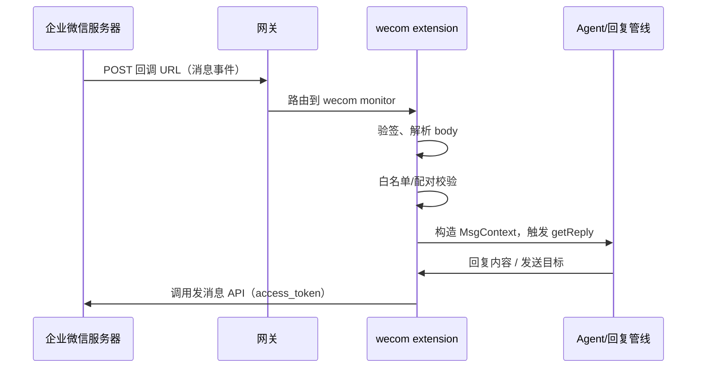
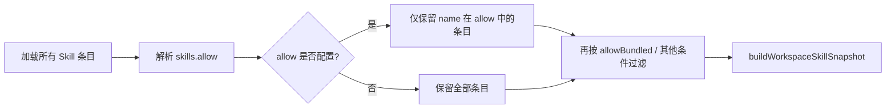
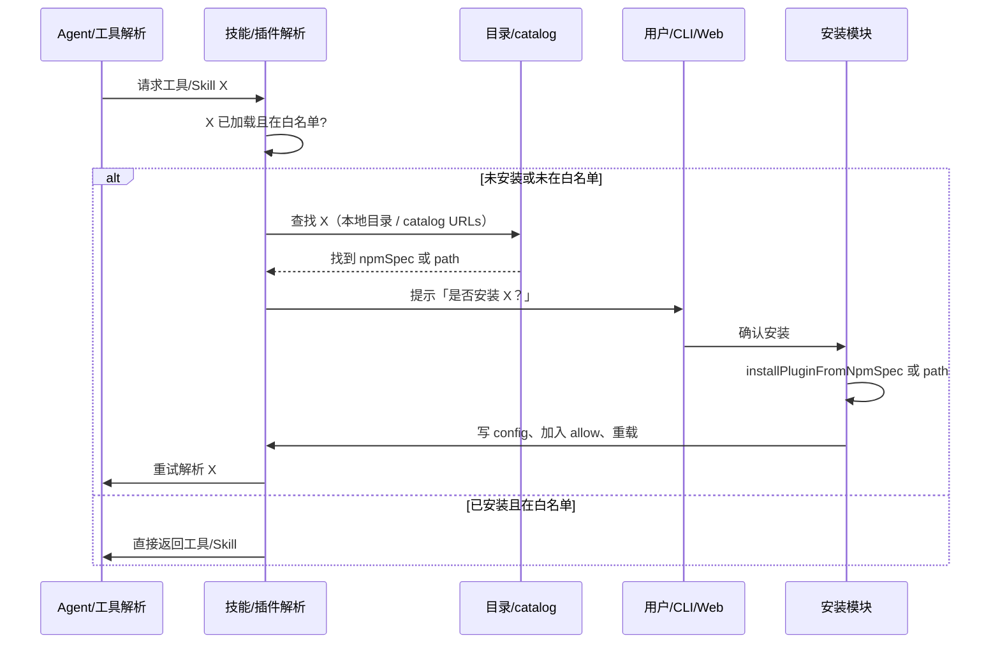
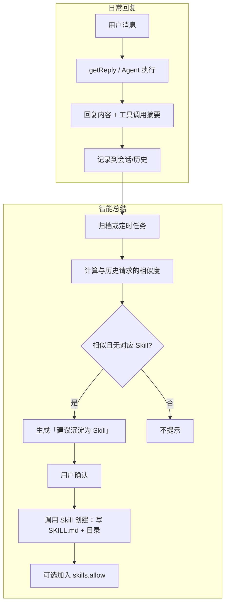
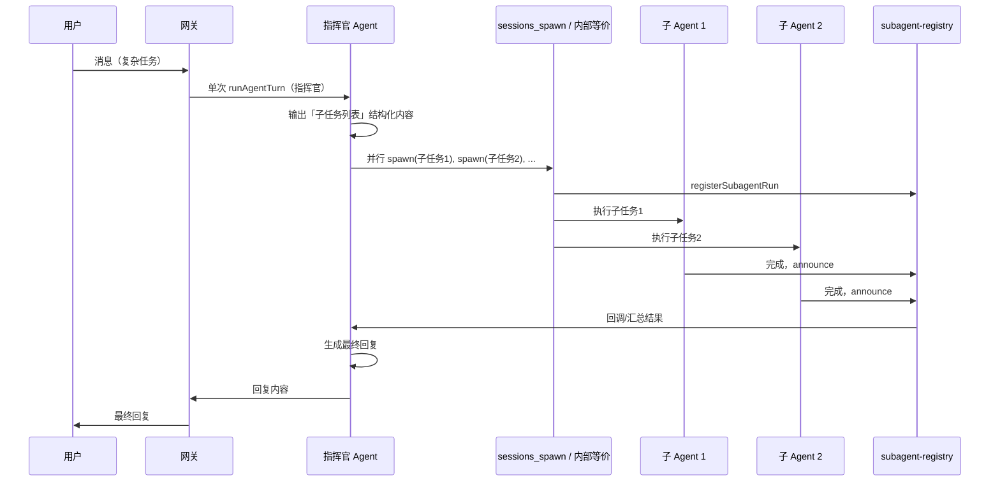
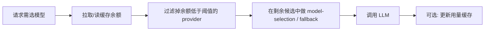

# 国产化开发方案 — 详细规格说明

本文档基于对 Moltbot 主仓库的调研，描述国产化改造的**功能定义**、**业务流程**与**实现方式**，供在新目录/新仓库中实施时参考。Moltbot 作为原项目保持只读参考，不直接在本仓库内实现全部功能；部分能力（如国产 LLM 集成与余额监控）需后续细节讨论后再定实现细节。

---

## 一、企业微信渠道（WeCom / 企微）

### 1.1 功能描述

- **目标**：新增企业微信作为消息渠道，支持单聊、群聊、应用消息与回调。
- **形态**：与 MS Teams 一致，作为**扩展渠道**（extension）实现，不并入 core，便于独立迭代与合规；新项目可从 Moltbot 复制 `extensions/` 与插件加载机制，在独立目录中新增 `extensions/wecom/`。
- **核心能力**：
  - **收消息**：企业微信应用回调（HTTP POST 到配置的 URL），校验签名、解析 XML/JSON 体，转换为与现有 `MsgContext` 兼容的入站结构。
  - **发消息**：通过企业微信「发送消息到应用」等 API，支持文本、图文、模板卡片等；需 access_token 管理与重试。
  - **配对/白名单**：与现有 pairing/allowlist 一致，支持按 UserID 或部门等做 allowFrom；配对通过后可选发送一条「已通过」类通知。
  - **Probe 与 Onboarding**：probe 检测配置是否有效（如 token 是否可获取）；onboarding 向导引导填写 CorpID、AgentID、Secret、回调 URL 等并写入 config。

### 1.2 业务流程

- **发消息流程**：回复管线或 outbound 调用 `sendMessageWecom(cfg, { to, text, ... })` → 解析 `to`（UserID/ChatID）→ 取 token → 调企业微信 HTTP API → 处理限流/重试。

### 1.3 实现方式

| 项目 | 说明 |
|------|------|
| **参考实现** | Moltbot 中 `extensions/msteams`：`channel.ts` 暴露 `ChannelPlugin`，实现 `config`、`pairing`、`outbound`、`gateway`、`onboarding`、`status` 等；`monitor.ts` 挂到网关路由；`token.ts` 做凭证解析；`send.ts` 封装发消息 API。 |
| **新项目目录** | 在新仓库中建立 `extensions/wecom/`，包含：`package.json`、`clawdbot.plugin.json`、`index.ts`（register channel）、`src/channel.ts`、`src/token.ts`、`src/send.ts`、`src/monitor.ts`、`src/inbound.ts`（解析回调 body）、`src/outbound.ts`、`src/onboarding.ts`、`src/probe.ts`、`src/resolve-allowlist.ts` 等。 |
| **配置** | 如 `channels.wecom.enabled`、`channels.wecom.corpId`、`channels.wecom.agentId`、`channels.wecom.secret`、`channels.wecom.token`（回调校验）、`channels.wecom.encodingAesKey`、`channels.wecom.allowFrom`、`channels.wecom.groupPolicy` / `groupAllowFrom`。 |
| **网关对接** | 扩展通过 `api.registerChannel({ plugin })` 注册；网关在加载插件后为 wecom 注册 HTTP 路由（如 `POST /wecom/callback`），由 monitor 处理请求并转交 reply 管线。 |
| **依赖** | 企业微信开放平台自建应用：CorpID、AgentID、Secret、回调 URL（需公网可访问）、Token 与 EncodingAESKey（回调加解密）。 |

---

## 二、Skills / MCP 白名单 + 找不到时自动查找并确认安装

### 2.1 功能描述

- **白名单**：
  - **Skills**：配置「仅允许加载的 Skill 名称列表」；未在白名单内的 skill 不参与 `buildWorkspaceSkillSnapshot` 的最终候选，Agent 不可见、不可调用。
  - **Plugins/MCP**：沿用 Moltbot 已有 `plugins.allow`（仅允许的插件 ID 加载）；新项目保持该语义，可选在文档中明确为「MCP/扩展白名单」。
- **自动查找与确认安装**：当 Agent 或用户请求的 Skill/MCP 未安装或未在白名单时，从预设目录或远程 catalog 查找 → 提示用户确认 → 安装并写入 config（并可选加入白名单）。

### 2.2 业务流程

**白名单过滤流程：**

- **实现要点**：在 `loadSkillEntries` 之后、`filterSkillEntries` 时，若 `config.skills.allow` 存在且非空，则只保留 `entry.skill.name` 或 `resolveSkillKey(entry.skill, entry)` 在该数组中的条目；然后再做 `shouldIncludeSkill`（allowBundled、requires 等）。

**自动查找与安装流程：**

### 2.3 实现方式

| 项目 | 说明 |
|------|------|
| **Skills 白名单** | 在 Moltbot 中：`src/config/types.skills.ts` 的 `SkillsConfig` 增加 `allow?: string[]`；`src/config/zod-schema.ts` 中 `skills` 下增加 `allow: z.array(z.string()).optional()`；`src/agents/skills/config.ts` 中新增 `resolveSkillsAllowlist(config)`，在 `shouldIncludeSkill` 中若 `allow` 存在且非空，则仅当 `skillKey`/`name` 在 allow 中时返回 true；`buildWorkspaceSkillSnapshot` 使用的 `filterSkillEntries` 依赖 `shouldIncludeSkill`，故会自然生效。新项目复制/移植上述逻辑即可。 |
| **Plugins 白名单** | 已有 `plugins.allow`（schema 见 `src/config/schema.ts`）；加载逻辑在 `src/plugins/loader.ts` / `manifest-registry.ts` 中，仅加载 allow 列表中的插件（若配置了 allow）。新项目保持该行为即可。 |
| **自动查找** | 「查找」数据源：本地 `plugins` catalog 文件（如 `~/.clawdbot/mpm/plugins.json`）、或配置项 `skills.catalogUrls` / `plugins.catalogUrls` 指向的 JSON；根据「工具名」或「Skill 名」匹配 catalog 中的 npmSpec 或 path。 |
| **确认安装** | 复用 Moltbot：`src/commands/onboarding/plugin-install.ts` 的 `ensureOnboardingPluginInstalled`（选择 npm/local/skip、调用 `installPluginFromNpmSpec`、`recordPluginInstall`、`enablePluginInConfig`）。新项目在「工具解析失败」或「Skill 未找到」的代码路径中，调用类似逻辑：先查 catalog → 若找到则调一次「确认安装」流程（CLI 用 prompter，Web 用 Gateway 暴露的「请求安装并确认」API），安装完成后写 config、可选追加到 `skills.allow` / `plugins.allow`，然后重载或重试。 |
| **配置** | `skills.allow`（可选 string[]）、`skills.allowBundled`（已有）、`skills.catalogUrls`（可选，用于查找）、`plugins.allow`（已有）、`plugins.catalogUrls`（可选）。 |

---

## 三、Skills 智能总结（重复请求沉淀为 Skill）

### 3.1 功能描述

- **目标**：识别「重复或相似的用户请求」，经用户确认后沉淀为可复用的 Skill（写入 managed skills 或 workspace skills），便于后续直接匹配调用。
- **能力**：
  - **记录**：在会话或全局存储「用户请求文本 + 最终采纳的回复/工具调用摘要」。
  - **相似度**：对历史请求做简单嵌入+相似度或关键词聚类，识别重复模式。
  - **建议**：当检测到「与历史某类请求相似」且「尚未绑定 Skill」时，提示「是否保存为 Skill」；用户确认后，调用「创建 Skill」能力写入 `~/.clawdbot/skills` 或 workspace skills。

### 3.2 业务流程

- **记录内容**：至少包含「请求文本」「回复摘要或工具调用序列」；可选「sessionKey」「时间戳」；存储位置可为会话 transcript 目录或单独 DB/文件。
- **相似度**：首版可用「关键词/短语匹配 + 简单向量相似度」（如小型嵌入模型或现有 embedding API）做粗筛；阈值可配置（如 `skills.autoSummarize.similarityThreshold`）。
- **Skill 创建**：参考 Moltbot 的 `skills/skill-creator/SKILL.md` 与既有「创建 SKILL.md」脚本/工具：根据「请求 + 回复摘要」生成 `name`、`description` 和 body，写入 `managedSkillsDir` 或 workspace 下 `skills/<name>/SKILL.md`。

### 3.3 实现方式

| 项目 | 说明 |
|------|------|
| **记录** | 在回复管线末端或会话持久化处（如写入 transcript 或专门 store）增加钩子：将「当前请求 + 最终回复摘要/工具调用列表」写入存储。新项目可新增 `src/agents/skills/request-log.ts` 或类似，提供 `appendRequestLog(sessionKey, request, summary)`。 |
| **相似度与建议** | 新模块如 `src/agents/skills/summarize.ts`：定期或按条读取历史记录，计算与当前请求的相似度；若超过阈值且无对应 Skill，则生成建议 payload（建议的 skill 名、描述、来源请求）。可配置：`skills.autoSummarize.enabled`、`skills.autoSummarize.similarityThreshold`、`skills.autoSummarize.minOccurrences`（至少出现 N 次再建议）。 |
| **建议展示与确认** | CLI：在会话结束或定时任务后输出「检测到可沉淀请求，是否保存为 Skill？」；Web：通过 Gateway 推送或状态接口展示建议，用户点击确认后调用「创建 Skill」接口。 |
| **创建 Skill** | 封装「根据名称、描述、body 写 SKILL.md」：可调用现有 skill-creator 的指导逻辑生成内容，然后 `fs.writeFile` 到 `managedSkillsDir/<name>/SKILL.md` 或 workspace `skills/<name>/SKILL.md`；可选把 `name` 加入 `skills.allow` 并触发重载。 |
| **配置** | `skills.autoSummarize.enabled`、`skills.autoSummarize.similarityThreshold`、`skills.autoSummarize.minOccurrences`、`skills.autoSummarize.storagePath`（可选）。 |

---

## 四、多智能体集群（指挥官式并行调度）

### 4.1 功能描述

- **目标**：一个「指挥官」Agent 接收复杂任务，拆分为多个子任务，并行调度多个子 Agent 执行，再汇总结果返回。
- **与现有能力关系**：
  - Moltbot 已有 `broadcast`：同一消息可并行/串行发给多个 Agent（`broadcast.<peerId> = [agentIds]`，`broadcast.strategy = parallel|sequential`）。
  - 已有 `sessions_spawn` 工具：主 Agent 可 spawn 子 Agent 会话执行子任务，结果通过 subagent announce 回传。
  - 本功能是在「单次用户请求」下，由**一个**指挥官 Agent 先做任务分解，再**并行** spawn 多个子任务，最后汇总为一条回复。

### 4.2 业务流程

- **指挥官输出格式**：可在 system prompt 中约定「输出 JSON 或结构化文本」，包含子任务数组（每项：task、label、可选 agentId/model）；运行时解析后调用 `sessions_spawn` 或内部等价 API 并行执行。
- **结果汇总**：子任务结果经现有 `runSubagentAnnounceFlow` 等回到主会话；指挥官在下一轮或同轮「汇总」消息中生成最终答案。

### 4.3 实现方式

| 项目 | 说明 |
|------|------|
| **配置** | 新配置如 `agents.coordinator.enabled`，或复用/扩展 `broadcast.strategy` 为 `coordinator`；指定「指挥官」使用的 agentId/model（可与默认 agent 相同）。 |
| **入口** | 在 `getReplyFromConfig` 或 agent 入口处：若启用 coordinator，则本次请求走「指挥官模式」：先跑一轮指挥官 Agent（带固定 system 片段：要求输出子任务列表），解析输出后调用 spawn 逻辑，等待所有子任务结束，再把结果注入指挥官上下文并再跑一轮生成最终回复。 |
| **spawn 与注册** | 直接复用 `src/agents/tools/sessions-spawn-tool.ts` 的 `createSessionsSpawnTool` 与 `src/agents/subagent-registry.ts` 的 `registerSubagentRun`、`waitForSubagentCompletion`；或在新模块 `src/agents/coordinator.ts`（或 `src/auto-reply/reply/coordinator.ts`）中封装「解析指挥官输出 → 批量 spawn → Promise.all 等待 → 汇总」的流程，不重复造轮子。 |
| **指挥官 Prompt** | 在 `buildAgentSystemPrompt` 或 channel 的 `agentPrompt` 中，当为 coordinator 模式时注入一段说明：要求输出指定格式的子任务列表（如 JSON array），并说明结果将自动汇总。 |
| **并行度与超时** | 子任务数量、并行度、单任务超时需可配置（如 `agents.coordinator.maxConcurrent`、`agents.coordinator.taskTimeoutSeconds`），避免资源打满。 |

---

## 五、国产 LLM 集成 + 余额监控与动态调度（待细节讨论）

### 5.1 功能描述

- **国产 LLM 集成**：接入国产模型（如 DeepSeek、通义千问、智谱、文心等）；多数提供 OpenAI 兼容 API，通过 `baseUrl` + `apiKey` 即可。
- **余额监控**：按厂商拉取「余额/用量」并缓存，供调度与告警使用。
- **动态调度**：在选模型前根据「当前 provider 余额是否低于阈值」排除或降级该 provider，再在剩余候选中选模型；可与现有 model-fallback、model-selection 结合。

以下为**基于调研的流程与实现思路**，具体厂商 API、阈值策略、存储方式等需后续讨论确定。

### 5.2 业务流程（草案）

- **余额拉取**：各厂商 API 不同（有的有「余额」接口，有的是「用量」统计）；需在 provider 层或独立模块中按 provider 调用对应接口，结果写入内存或轻量存储（如 JSON 文件、Redis），并设 TTL 避免频繁请求。
- **动态调度**：在 `createModelSelectionState` 或 `runWithModelFallback` 前，先根据「当前余额缓存」过滤掉不可用的 provider，再在剩余列表中选模型/走 fallback。

### 5.3 实现方式（草案，待讨论）

| 项目 | 说明 |
|------|------|
| **国产 provider 与 catalog** | 在 `src/agents/model-catalog.ts` 与 config 的 `models.providers` 中增加国产厂商：如 `deepseek`、`qwen`、`zhipu` 等，配置 `baseUrl`、`apiKey`；model catalog 中登记各厂商模型 ID。现有 `model-fallback`、`model-selection` 已支持多 provider，无需改核心逻辑。 |
| **余额/用量 API** | 各厂商文档不一致，需逐个对接。新模块如 `src/agents/llm-balance.ts`：按 provider 调用其「余额」或「用量」接口，返回统一结构（如 `{ provider, balance?, usage?, expiresAt }`）；配置项如 `models.providers.<id>.balanceCheckUrl` 或 `usageApi`、请求方法、解析方式。首版可先支持 1～2 家，其余仅做模型接入。 |
| **缓存与阈值** | 内存或文件缓存，带 `expiresAt`；配置告警阈值如 `models.providers.<id>.balanceThreshold`，低于该值时视为不可用，从候选列表中剔除。 |
| **与 model-selection 对接** | 在 `createModelSelectionState` 或 fallback 构建 candidate 列表时，先调用 `getProviderBalances(cfg)`，过滤掉 `balance < threshold` 的 provider，再生成 `allowedModelKeys` / candidate 列表。 |
| **待讨论** | 具体厂商列表、每家 API 形态、错误与限流处理、多账号/多 profile 下的余额聚合方式、告警通知方式等。 |

---

## 六、国产化品牌与 UI（中文名、中文界面、国产主题、一键部署）

### 6.1 功能描述

- **品牌与命名**：产品中文名、Slogan；通过构建变量或配置在国产版中切换，不污染上游 Moltbot 默认英文。
- **中文界面**：Web 控制台与 CLI 关键路径提供中文文案；通过 locale 或 config 选择语言。
- **国产主题**：在现有 UI 主题上增加「国产/政务」等主题变体（色板、圆角、字体）。
- **一键部署**：提供国产化一键安装脚本（及可选 docker-compose），实现「一条命令启动网关 + 企微 + 国产 LLM」的示例部署。

### 6.2 业务流程

- **品牌**：构建时注入变量（如 `PRODUCT_NAME_ZH`、`TAGLINE_ZH`），在 banner、tagline、UI 标题处读取；未设置时回退到英文。
- **中文界面**：应用启动或首次加载时根据 `locale` 或 config 选择语言；请求对应 JSON 或使用内联 map 渲染导航、设置、通道状态等。
- **主题**：用户选择「国产主题」时，切换 CSS 变量或主题类名，应用预设色板与字体。
- **一键部署**：用户执行安装脚本（如 `curl ... | bash -s -- --channel wecom --default-llm deepseek`）→ 安装 Node、安装包、写默认 config → 可选启动 gateway；或 `docker-compose up` 使用预置 compose 文件。

### 6.3 实现方式

| 项目 | 说明 |
|------|------|
| **品牌** | Moltbot 中：`src/cli/banner.ts`、`src/cli/tagline.ts` 当前写死英文；新项目改为从环境变量或 config（如 `meta.productNameZh`、`meta.taglineZh`）读取，无则用默认英文。UI：`ui/src/ui/app-render.ts` 中 brand title、subtitle 同理改为可配置或根据 locale 选择。 |
| **中文文案** | 新增 `ui/src/locales/zh.json`（或内联 map），key 与现有英文文案对应；入口根据 `locale` 或 config 选择 zh/en，渲染时取对应字符串。CLI：onboarding、关键命令说明可增加 `--locale zh` 或从 config 读，输出中文提示。 |
| **国产主题** | 在 UI 的 theme 逻辑上增加一项（如 `domestic`），对应一套 CSS 变量（主色、圆角、字体）；切换主题时加上该类名或变量作用域。 |
| **一键部署** | 新项目可维护单独脚本（如 `install-domestic.sh`），内部调用与现有 `install.sh` 类似的逻辑，但默认写入国产化推荐 config（如启用 wecom、默认 LLM 为 deepseek）；或提供 `docs/install/domestic.md` 与示例 `docker-compose.yml`，列出步骤与一条命令示例。 |

---

## 七、文档与仓库使用说明

- **新项目**：可将本文档复制到新仓库的 `docs/` 下，作为国产化开发的规格基准；实施时以 Moltbot 为只读参考，在新目录中实现功能。
- **国产 LLM 与余额**：第五章为草案，具体 API、阈值、存储与告警需单独讨论后再补充到本文档或单独子文档。
- **变更与反馈**：若某功能在实现中需要更细的流程或接口说明，可在本文档对应章节追加「实现细节」或链接到设计文档。
